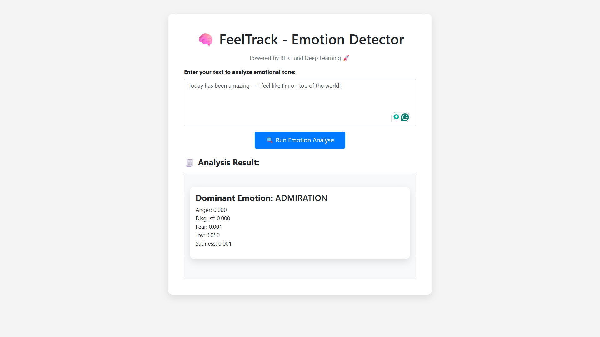

# 💙 FeelTrack - Emotion Detection Web App (Local Version)

> ⚡ Real-time emotion classification using BERT + Flask  
> 🎓 Built after completing IBM AI Application using Flask  
> 👨‍💻 Runs locally on `localhost:5000`

---

## 📌 Overview

**FeelTrack** is a local web app that detects emotions from user-input text using a fine-tuned BERT model from HuggingFace. It's an upgraded version of the [Sentiment Analyzer Prototype](https://github.com/Yaswanth876/sentiment-analyzer-bert-nlp.git), originally built during the IBM AI Application course.

---

## 🔍 Features

- Detects emotions like Joy, Anger, Sadness, Fear, etc.
- Uses `transformers` and `torch` for deep learning inference
- Simple and clean UI using HTML + Bootstrap
- Built using Flask (Python backend)

---

### 📸 Preview



---

## 🚀 Tech Stack

| Layer | Tech |
|------|------|
| 🧠 NLP | `transformers`, `torch`, `pipeline()` |
| 🌐 Backend | Flask |
| 🖼️ Frontend | HTML5, Bootstrap, JS |
| 📦 Package Manager | pip |

---

## 🚀 Getting Started (Localhost)

### 1. Clone this repository

```
git clone https://github.com/Yaswanth876/FeelTrack-nlp.git
cd FeelTrack-nlp
```
### 2. Install dependencies

```
pip install -r requirements.txt
```

If requirements.txt is missing, install manually:
```
pip install flask transformers torch
```

### 3. Run the app

```
python app.py
```
App will run at: http://localhost:5000

---

### 🧠 Model Used
```
Model: bhadresh-savani/bert-base-go-emotion

```
Platform: Hugging Face

Trained to detect 6 emotions: anger, fear, joy, love, sadness, surprise

---

### 📂 Folder Structure

```
FeelTrack-nlp/
│
├── app.py                # Main Flask app
├── templates/
│   └── index.html        # Frontend template
├── static/               # Optional: CSS, JS
├── requirements.txt
└── README.md
```

---

### 👨‍💻 Author

**Yaswanth V** — AI/ML Aspirant | Python Developer
📍 Madurai, Tamil Nadu
🎓 Thiagarajar College of Engineering


---

## 📌 License

This project is licensed under the [MIT License](LICENSE).
